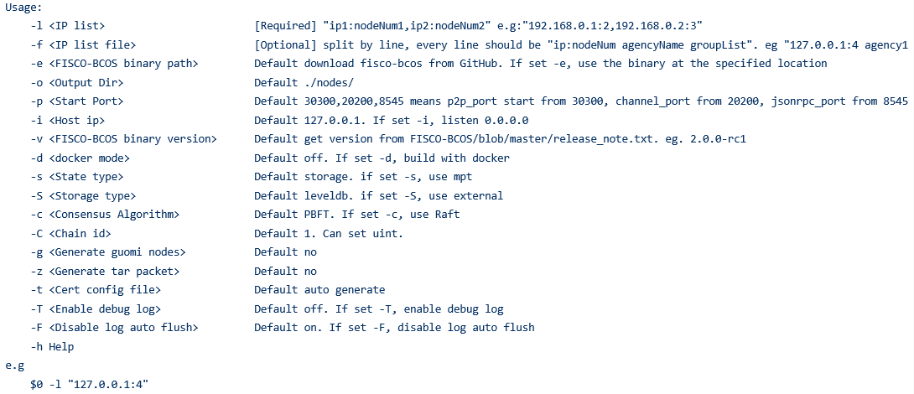

# build_chain.sh理解

build_chain.sh脚本用于快速生成一条链中节点的配置文件，脚本依赖于openssl

- **帮助**

- **常用选项**

**l选项**: 用于指定要生成的链的IP列表以及每个IP下的节点数，以逗号分隔。脚本根据输入的参数生成对应的节点配置文件，其中每个节点的端口号默认从30300开始递增，所有节点属于同一个机构和群组。

**f选项**:用于根据配置文件生成节点，相比于l选项支持更多的定制。
按行分割，每一行表示一个服务器，格式为IP:NUM AgencyName GroupList，每行内的项使用空格分割，不可有空行。

> IP:NUM表示机器的IP地址以及该机器上的节点数。AgencyName表示机构名，用于指定使用的机构证书。GroupList表示该行生成的节点所属的组，以,分割。例如192.168.0.1:2 agency1 1,2表示ip为192.168.0.1的机器上有两个节点，这两个节点属于机构agency1，属于group1和group2。

-l选项指定节点IP和数目。-f选项通过使用一个指定格式的配置文件，支持创建各种复杂业务场景FISCO BCOS链。**-l和-f选项必须指定一个且不可共存。**
