# DAY1 练习

1.查看区块高度
`[group:1]> getBlockNumber`

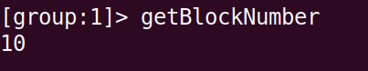

前几次部署未截图，故初始区块为10

2.获取区块数据
`[group:1]> getBlockByNumber xx`

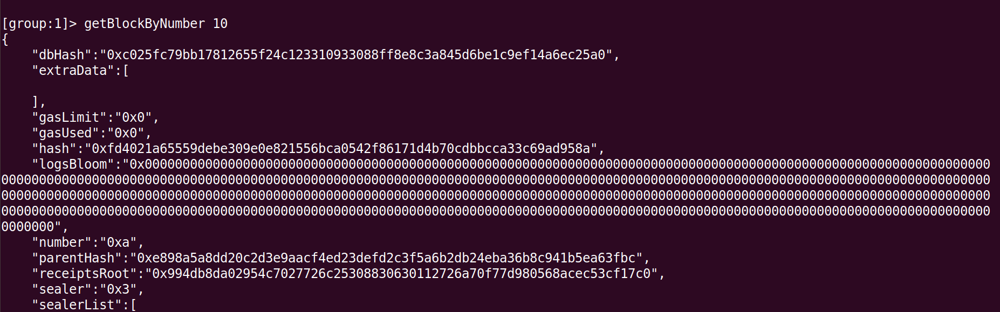

3.部署HelloWorld智能合约
`[group:1]> deploy HelloWorld`

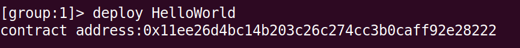

第一次部署时未截图，故有两次部署记录

4.使用查看getDeployLog
`[group:1]> getDeployLog`

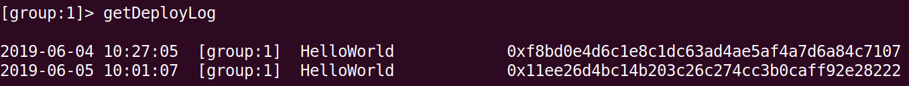

5.调用智能合约
`[group:1]> call HelloWorld xxaddressxx set "Welcome!"`
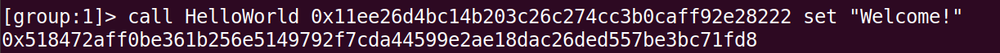

6.再次查看区块高度
`[group:1]> getBlockNumber`

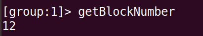

7.获取区块数据
`[group:1]> getBlockByNumber xx`

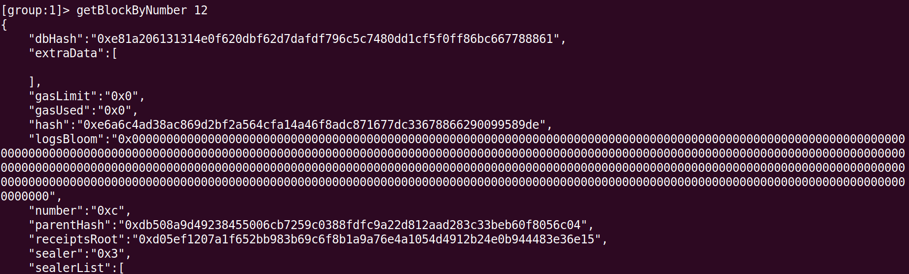
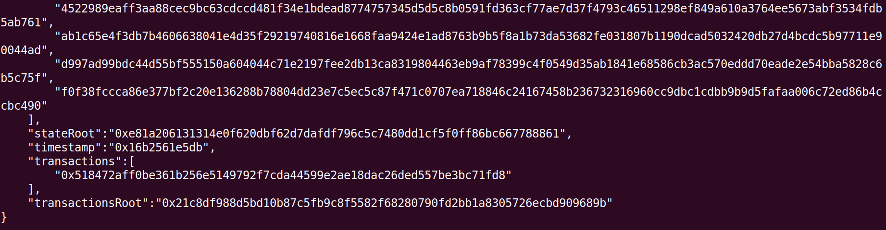

8.按CNS方式部署HelloWorld智能合约
`[group:1]> deploy HelloWorld`

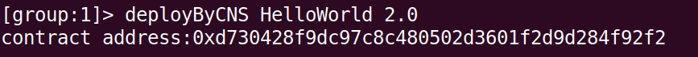

9.再次查看区块高度
`[group:1]> getBlockNumber `

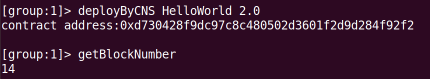

10.获取区块数据
`[group:1]> getBlockByNumber xx`
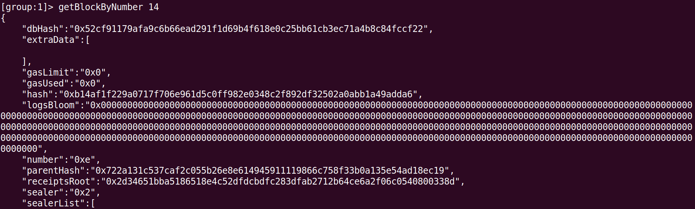
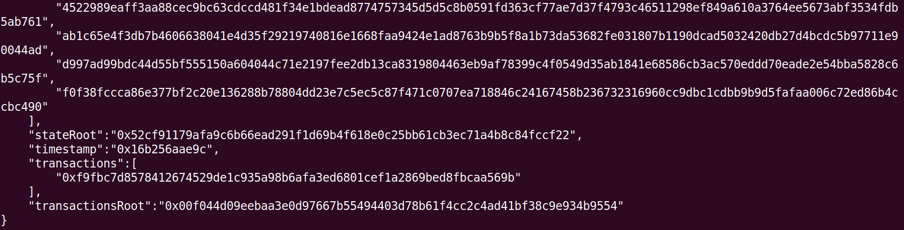

