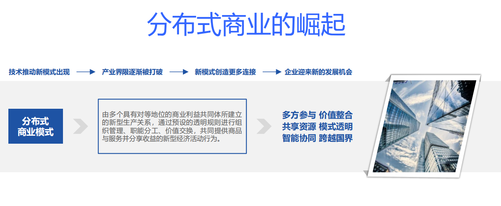
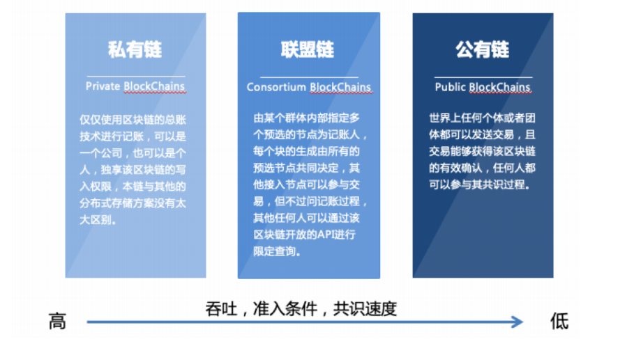
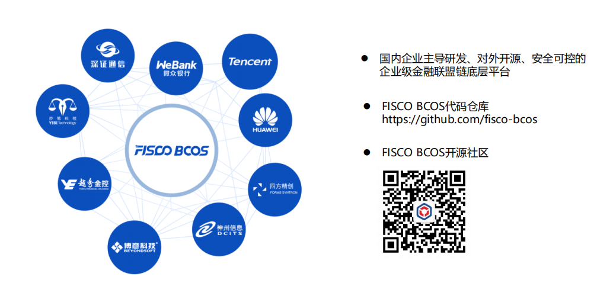

## 周报1
吴峻羽

# 学习记录

### 1.了解区块链历史

### 2.区块链定义

分布式数据存储、点对点传输、共识机制、加密算法等计算机技术的新型应用模式

### 3.区块链相关技术

- 分布式账本技术(DLT:Distributed Ledger Technology)
- 点对点网络(P2P技术)
- 非对称加密
- 共识机制
- 智能合约

### 4.区块链技术选型

### 5.区块链密码学基础

- 哈希算法
- 加解密算法
- 消息认证码与数字签名
- 数字证书
- PKI体系
- Merkle树结构

### 6.体验区块链场景

1. 熟悉区块数据结构，了解哈希算法；
2. 简单了解哈希碰撞(挖矿)的流程，并对发起新交易流程有所了解；
3. 熟悉区块链的不可篡改性、顺序性，以及区块链分叉时的场景。

### 7.了解FISCO-BCOS

开源联盟链底层平台

### 8.快速搭建FISCO BCOS区块链网络

1. 了解FISCO BCOS配置文件及配置项
2. 使用FISCO BCOS控制台完成简单操作

> 见于“作业”文件