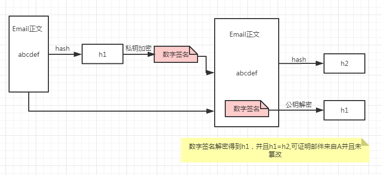
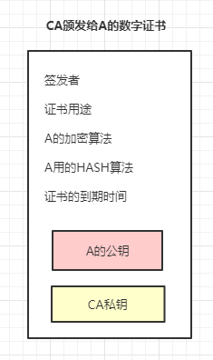
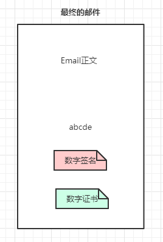
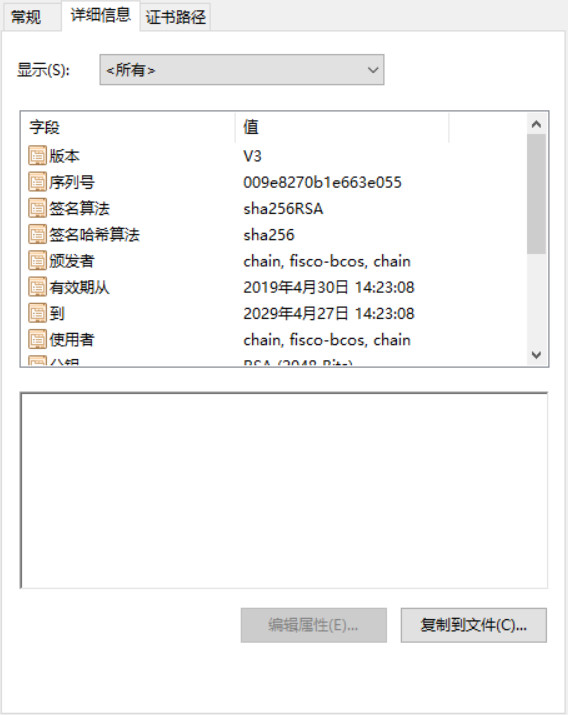
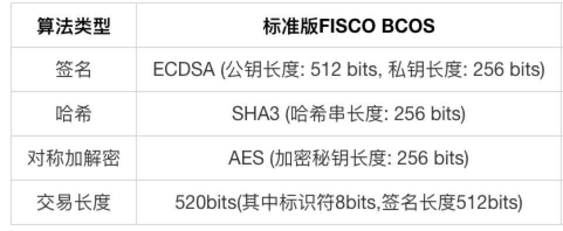

## 周报2
吴峻羽

# 学习记录

# 1.理解build_chain.sh语句

链构造操作及节点结构

> 见于“build_chain.sh理解”文件

# 2.完善虚拟机环境配置

# 3.了解区块链相关加密技术

## 非对称加密
把密钥分为公钥和私钥，公钥是公开的所有人都可以认领，私钥是保密的只有一个人知道。
>  假设A要发送一封Email给B，他不想让任何其他人在传输中看到Email的内容，做法就是使用B的公钥对Email加密，只有B的私钥能够解密（B的私钥唯一性保证信件不会泄露）。
>  某天出意外了，有黑客冒充A给B发送Email，并且也用B的公钥加密，导致B无法区分这封邮件是否来自A。怎么办？此时A可以用自己的私钥加密，那么B收到邮件后如果用A的公钥可以解密邮件，那么证明这封信肯定来自于A。

#### 总结：

- 公钥的作用：对内容本身加密，保证不被其他人看到
- 私钥的作用：证明内容的来源
- 公钥和私钥是配对关系，公钥加密就用私钥解密，反之亦然，用错的密钥来尝试解密会报错

## 数字签名

假设A用自己的私钥对Email加密发送，这存在下面问题：

> 对文件本身加密可能是个耗时过程，比如这封Email足够大，那么私钥加密整个文件以及拿到文件后的解密无疑是巨大的开销。

数字签名可以解决这个问题：

1. A先对这封Email执行哈希运算得到hash值简称“摘要”，取名h1
1. 然后用自己私钥对摘要加密，生成的东西叫“数字签名”
1. 把数字签名加在Email正文后面，一起发送给B（当然，为了防止邮件被窃听你可以用继续公钥加密，这个不属于数字签名范畴）
1. B收到邮件后用A的公钥对数字签名解密，成功则代表Email确实来自A，失败说明有人冒充
1. B对邮件正文执行哈希运算得到hash值，取名h2
1. B会对比第4步数字签名的hash值h1和自己运算得到的h2，一致则说明邮件未被篡改。

#### 总结：

**数字签名**是利用算法（不一定是非对称算法）对原文hash值加密，然后附着到原文的一段数据。数字签名的作用就是验证数据来源以及数据完整性，解密过程则称为数字签名验证。

## 数字证书

公钥是公开的并且可以自行导入到电脑，如果有人比如C偷偷在B的电脑用自己公钥替换了A的公钥，然后用自己的私钥给B发送Email，这时B收到邮件其实是被C冒充的但是他无法察觉。解决办法就是**数字证书**。那么数字证书是怎么生成的呢？以及如何配合数字签名工作呢？

首先A去找"证书中心"（certificate authority，简称CA），为公钥做认证。证书中心用自己的私钥，对A的公钥和一些相关信息一起加密，生成"数字证书"（Digital Certificate）：

A在邮件正文下方除了数字签名，另外加上这张数字证书

B收到Email后用CA的公钥解密这份数字证书，拿到A的公钥，然后验证数字签名，后面流程就和图1的流程相同，不再赘述。

# 4.了解FISCO BCOS证书机制

## Part1：FISCO BCOS 证书结构

FISCO BCOS网络采用面向CA的准入机制，使用x509协议的证书格式，支持任意多级的证书结构，保障信息保密性、认证性、完整性及不可抵赖性。根据现有业务场景，FISCO BCOS默认采用三级的证书结构，自上而下分别为链证书、机构证书、节点证书。

▲ 图：x509协议的证书格式

> 证书内容包括了证书版本号、序列号、证书的签名算法、消息摘要算法等生成信息；同时包括了证书的颁发者、有效期、使用者、公钥信息、SSL通信需要用到的密码套件等信息。

节点通过加载证书，在接受数据包时，根据证书规定的密码套件和其消息字段，对数据包中携带的证书进行验证。

## Part2：角色定义

FISCO BCOS的证书结构中有４种角色，分别是联盟链委员会、联盟链成员机构、联盟链参与方（节点和SDK）。

**1.联盟链委员会**

联盟链委员会拥有联盟链的根证书ca.crt和私钥ca.key，通过使用ca.key对联盟链成员机构签发机构证书，负责完成联盟链成员机构的准入、剔除等操作。

**2.联盟链成员机构**

联盟链成员机构为经过联盟链委员会许可，加入到联盟链的机构。联盟链成员机构拥有机构私钥agency.key和经过根私钥ca.key签发的机构证书agency.crt。联盟链成员机构可以通过机构私钥签发节点证书，从而配置本机构的节点和SDK。

**3.联盟链参与方**

联盟链参与方可以通过运行节点或SDK联盟链交互，拥有与其他节点进行通信的节点证书node.crt和私钥node.key。联盟链参与方运行节点或SDK时，需要加载根证书ca.crt和相应的节点证书node.crt和私钥node.key；与其他成员进行网络通信时，使用预先加载的证书进行身份认证。

## Part3：证书生成流程

**1.联盟链委员会初始化根证书ca.crt**

- 本地生成私钥ca.key
- 自签生成根证书ca.crt

**2.联盟链成员机构获取机构证书agency.crt**

- 本地生成私钥agency.key
- 由本地私钥生成证书请求文件agency.csr
- 将证书请求文件agency.csr发送至联盟链委员会
- 联盟链委员会使用ca.key对证书请求文件agency.csr进行签发，得到联盟链成员机构证书agency.crt
- 联盟链委员会将联盟链成员机构证书agency.crt发送至对应成员

**3.节点/SDK获取证书node.crt**

- 本地生成私钥node.key；
- 由本地私钥生成证书请求文件node.csr；
- 将证书请求文件node.csr发送至联盟链成员机构；
- 联盟链成员机构使用agency.key对证书请求文件node.csr进行签发，得到节点/SDK证书node.crt；
- 联盟链成员机构将节点证书node.crt发送至对应实体。

▲ 图：节点私钥相关说明
