# set -e
###### 你写的每个脚本都应该在文件开头加上set -e,这句语句告诉bash任何语句的执行结果如果不是true则应该退出

## build_chain.sh内部函数
### 参数设置值
### 打印结果
### fail_message 
### 检查环境 check_env()4
### 检查并安装国密tasslcheck_and_install_tassl()
### 得到名字getname()
### 检查名字check_name()
### 文件必须存在file_must_exists()

### 目录必须不存在 dir_must_not_exists()
### 生成链证书gen_chain_cert()
### 生成代理证书 gen_agency_cert()
### 使用签名算法secp256k1,gen_cert_secp256k1()
### 生成节点证书gen_node_cert() 
### 生成gmsm2的参数 generate_gmsm2_param()
### 生成链条证书的gm加密算法gen_chain_cert_gm() 
### 生成代理证书的gm加密算法gen_agency_cert_gm() 

### 用扩展的gm加密算法生成节点证书gen_node_cert_with_extensions_gm() 

### 得到gm算法的Node证书 gen_node_cert_gm()

### 生成config的ini generate_config_ini()

### 生成组起源 generate_group_genesis

###  生成组内初始化 generate_group_ini()

### 生成证书设置 generate_cert_conf()

### 生成脚本模板 generate_script_template()

### 生成证书设置gm算法 generate_cert_conf_gm()

### 生成节点脚本 enerate_node_scripts()

### 生成Trans的测试 genTransTest()

### 生成服务器的脚本 generate_server_scripts()

### 解析ip设置 parse_ip_config()
### main主函数

 ## 开启控制台
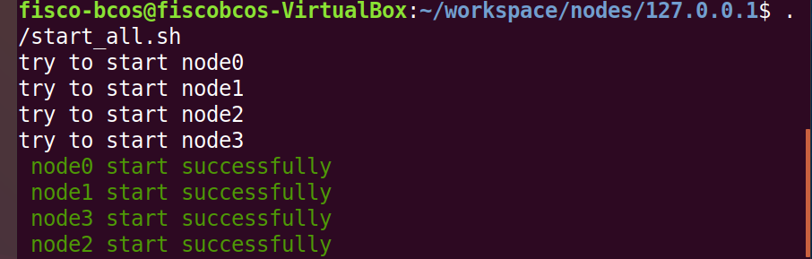
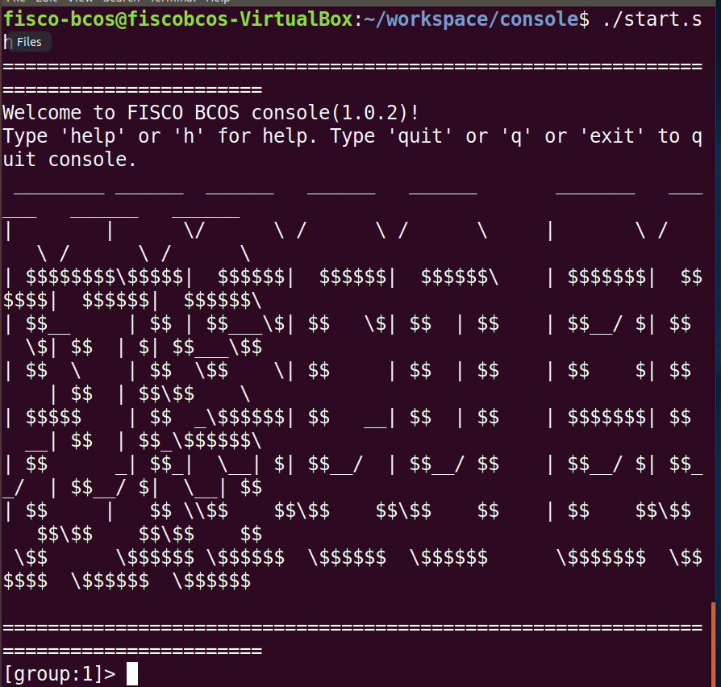
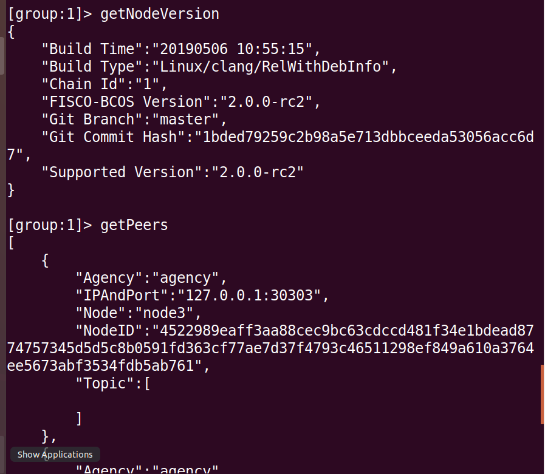
## 1.查看区块高度
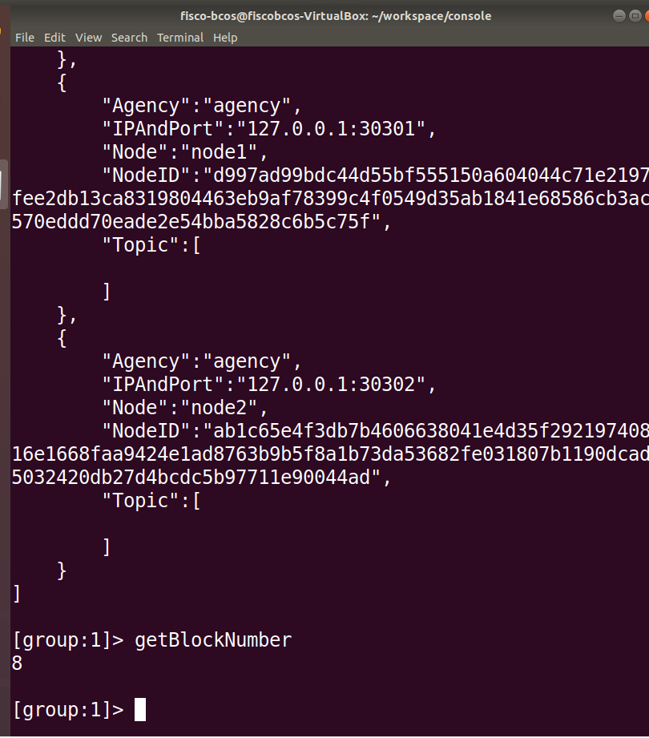
## 2.获取区块数据
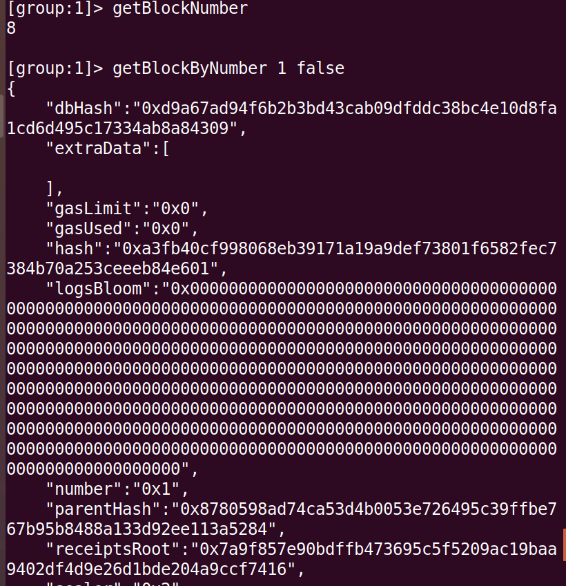
## 3.部署Hello World智能合约
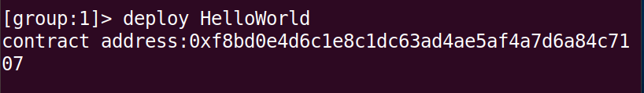
## 4.使用查看getDeployLog
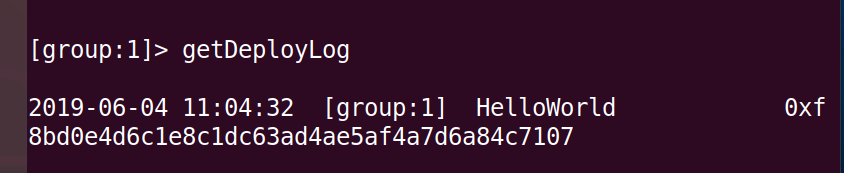  
## 5.调用智能合约
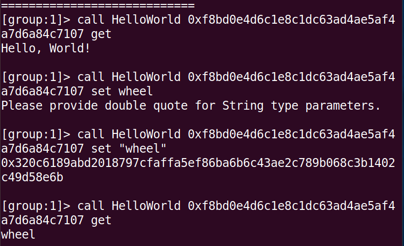
 
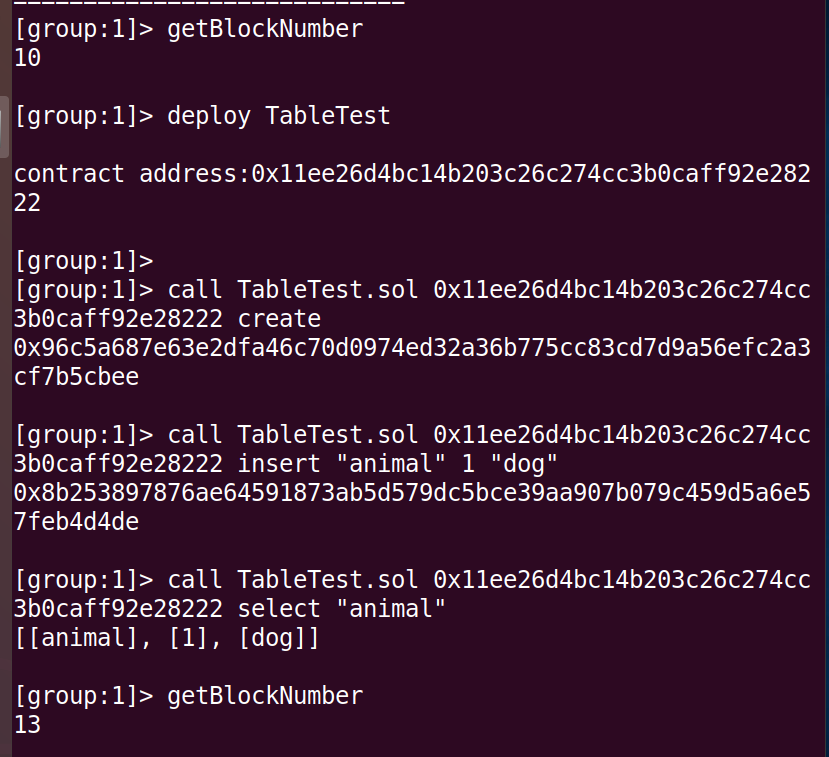   
## 6.再次查看区块高度
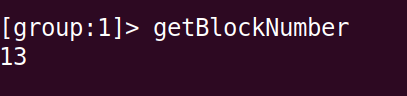
## 7.获取区块数据
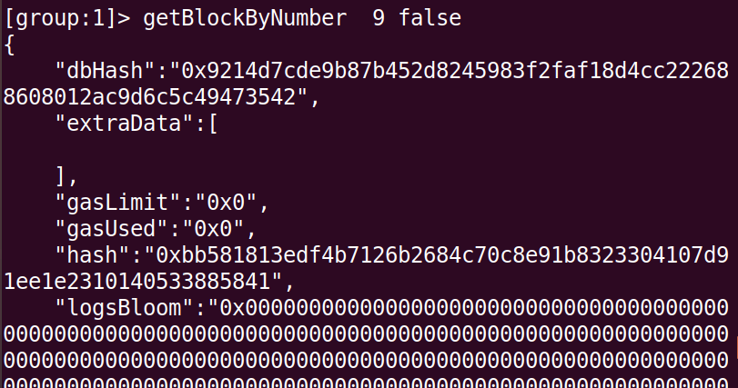
## 8.按CNS方式部署HelloWorld智能合约
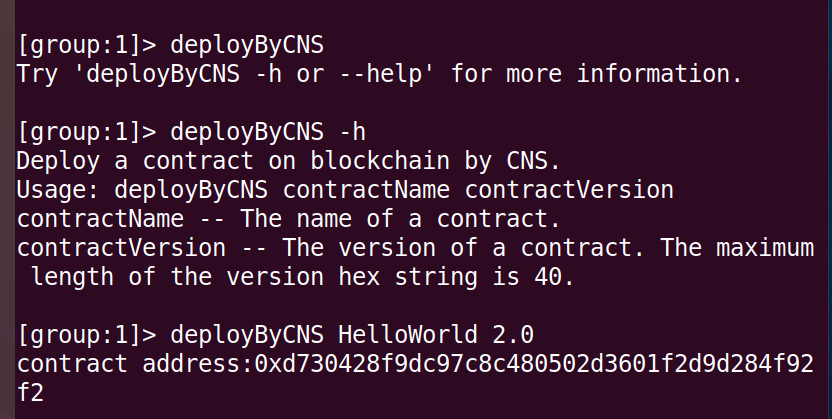
## 9.再次查看区块高度
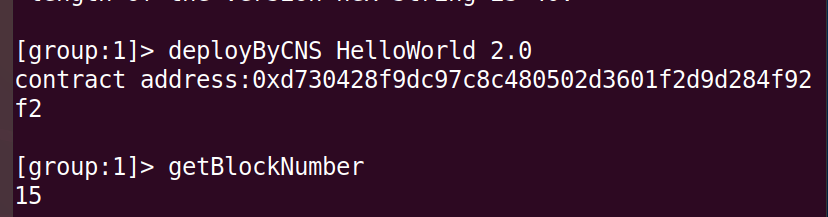
# 10.获取区块数据
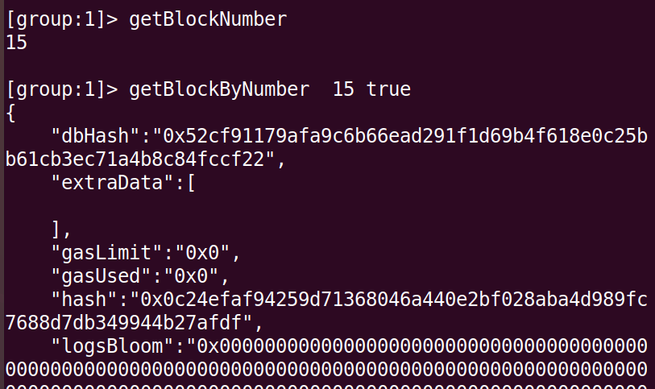