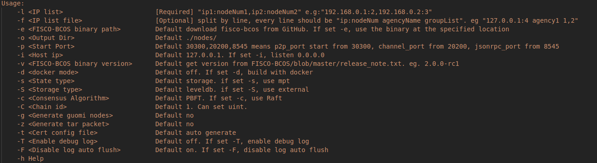
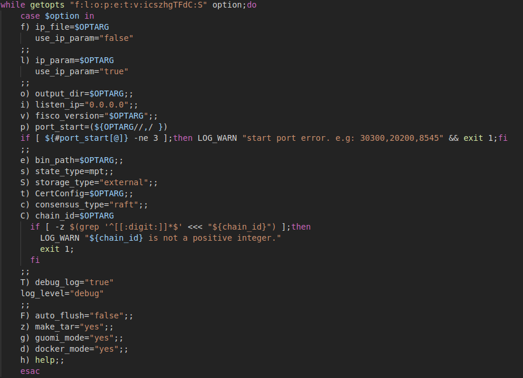
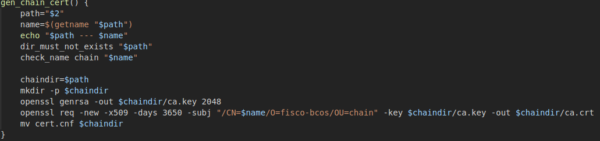
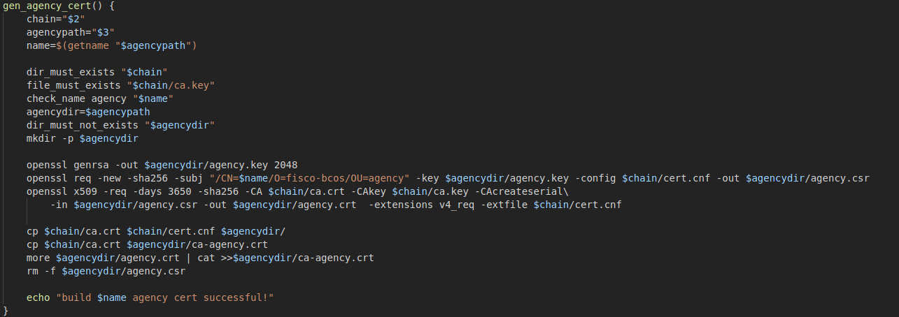
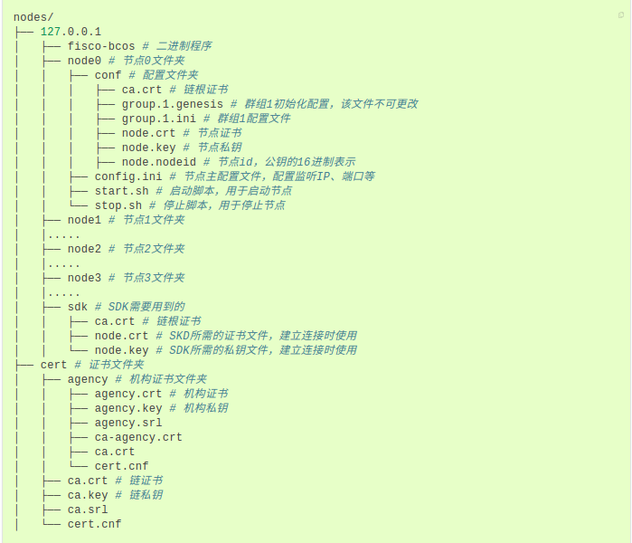

# build_chain.sh的理解

- 正如作者所说，联盟链中，链上的多方参与是一种协作关系；联盟链向授权的组织或机构开放，有准入机制。在准入机制中，证书是各参与方互相认证身份的重要凭证；可以说，证书机制是联盟链网络安全的基石。
- build_chain可以轻松搭建联盟链。

### 关于FISCO BCOS的准入机制
- FISCO BCOS采用面向CA的准入机制，使用x509协议的证书格式。
- 节点通过加载证书，在接受数据包时，根据证书规定的密码套件和其消息字段，对数据包中携带的证书进行验证。

#### FISCO BCOS的证书结构有4种角色
- 联盟链委员会
- 联盟链成员机构
- 联盟链参与方

1、 联盟链委员会拥有联盟链的根证书ca.crt和私钥ca.key，通过使用ca.key对联盟链成员机构签发机构证书，负责完成联盟链成员机构的准入、剔除等操作。

2、 联盟链成员机构为经过联盟链委员会许可，加入到联盟链的机构。联盟链成员机构拥有机构私钥agency.key和经过根私钥ca.key签发的机构证书agency.crt。联盟链成员机构可以通过机构私钥签发节点证书，从而配置本机构的节点和SDK。

3、 联盟链参与方可以通过运行节点或SDK联盟链交互，拥有与其他节点进行通信的节点证书node.crt和私钥node.key。联盟链参与方运行节点或SDK时，需要加载根证书ca.crt和相应的节点证书node.crt和私钥node.key；与其他成员进行网络通信时，使用预先加载的证书进行身份认证。

### build_chain.sh源码
> build_chain可以轻松搭建联盟链

#### help()

通过help()函数可以看到各参数项以及它的作用，值得注意的是，-l选项和-f选项均可搭建链，并且两者不可共存

-l 用于指定要生成的链的IP列表以及每个IP下的节点数，以逗号分隔。脚本根据输入的参数生成对应的节点配置文件，其中每个节点的端口号默认从30300开始递增，所有节点属于同一个机构和群组。
-f 用于根据配置文件生成节点，相比于l选项支持更多的定制。

上图是对参数项的解析，可以看到解析参数项f和l时的一些变量设置

以下是通过l选项进行建链的说明（use_ip_param = true)

### 通过源码分析证书生成流程（主要讨论非国密情况）
> .key为私钥文件 .crt为证书文件 .csr为证书请求文件

- 本地生成私钥2048位ca.key(通过rsa加密算法生成私钥)；
- 自签生成根证书ca.crt;

- 本地生成私钥agency.key；
- 由本地私钥生成证书请求文件agency.csr；
- 将证书请求文件agency.csr发送至联盟链委员会；
- 联盟链委员会使用ca.key对证书请求文件agency.csr进行签发，得到联盟链成员机构证书agency.crt；
- 联盟链委员会将联盟链成员机构证书agency.crt发送至对应成员。

- 本地生成私钥node.key（其中先获得椭圆曲线密钥生成参数，通过该参数生成私钥值）；
- 由本地私钥生成证书请求文件node.csr；
- 将证书请求文件node.csr发送至联盟链成员机构；
- 联盟链成员机构使用agency.key对证书请求文件node.csr进行签发，得到节点/SDK证书node.crt；
- 联盟链成员机构将节点证书node.crt发送至对应实体。

- 最后生成相关的配置config.ini start.sh stop.sh

### 最终文件夹结构及相关文件注释（取自官网）

