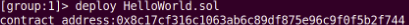
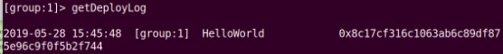
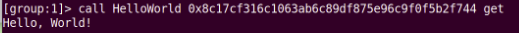
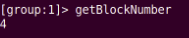
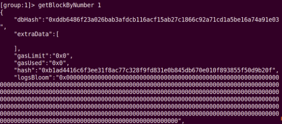
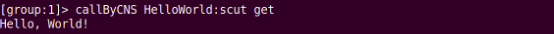
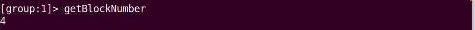
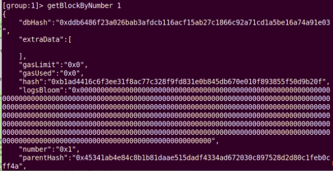

# 快速搭建FISCO BCOS区块

> 本次实验使用build_chain.sh脚本在本地搭建一条4节点的FISCO BCOS链，并配置及使用控制台进行练习

#### 部署HelloWorld

#### 使用查看getDeployLog

#### 调用智能合约

#### 再次查看区块高度

#### 获取区块数据

#### 按CNS方式部署HelloWorld智能合约

#### 再次查看区块高度

#### 获取区块数据

