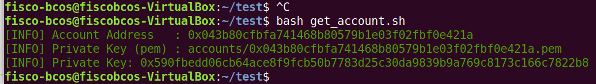
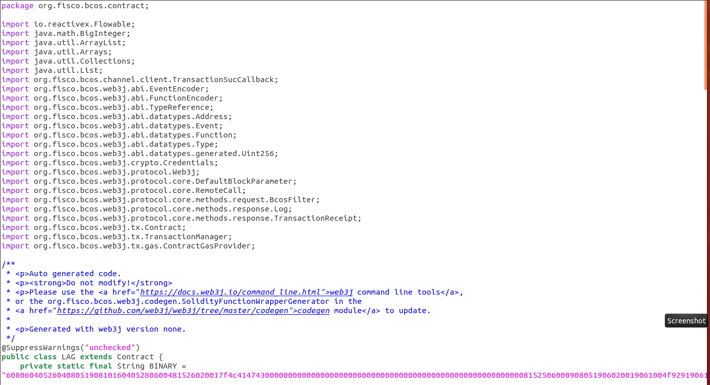

## 僵尸游戏熟悉solidity规则


通过僵尸游戏大致了解了Solidity语言

#### 数据类型

true / false

uint(8、16、32.....256)

string

bytes

#### 数组

uint[]

#### 结构体struct

 struct User {
      string name;
      uint age;
    }

#### 函数

四种作用域

public
private
internal
external

#### memory&storage

memory可回收，暂时性，函数调用结束后则消失

storage（默认的状态变量）永远写入区块链，无法更改且永久存在

##### 函数修改器 modifier

修改器是一种合约属性，可被继承可重写。


## 部署LAG积分合约（控制台）

#### 编写合约

```
pragma solidity ^0.4.24;

contract LAG{
    string name="LAGC";
    string symbol="LAG";
    uint256 totalSupply;
    
    mapping(address=>uint256) private balances;
    event transferEvent(address from, address to, uint256 value);
    
    constructor(uint256 initialSupply, string CreditName, string CreditSymbol) public{
        totalSupply=initialSupply;
        balances[msg.sender]=totalSupply;
        name=CreditName;
        symbol=CreditSymbol;
    }
    function getTotalSupply() constant public returns (uint256){
        return totalSupply;
    }
    function _transfer(address _from, address _to, uint256 _value) internal{
        require(_to!=0x0);
        require(balances[_from]>=_value);
        require(balances[_from]+_value>=balances[_from]);
        uint previousBalances=balances[_from]+balances[_to];
        
        balances[_from]-=_value;
        balances[_to]+=_value;
        
        emit transferEvent(_from,_to,_value);
        assert(balances[_from]+balances[_to]==previousBalances);
    }
    function transfer(address _to, uint256 _value) public {
		_transfer(msg.sender, _to, _value);
	}
    function balanceOf(address _owner) constant public returns (uint256){
        return balances[_owner];
    }
}
```

#### 部署与测试

创建商家账号



使用私钥登录

部署积分合约，总积分500

显示总积分


创建用户账户


在商家账户的控制台中分配积分并查看


## spring-boot-starter部署

##### 下载

##### 拷贝SDK证书

```
git clone https://github.com/FISCO-BCOS/spring-boot-starter.git
cp fisco/nodes/127.0.0.1/sdk/* asset-app/src/test/resources/
```

##### 修改application.yml

```
encrypt-type: 0  # 0:standard, 1:guomi
group-channel-connections-config:
  all-channel-connections:
  - group-id: 1  #group ID
    connections-str:
                    - 127.0.0.1:20200  # node listen_ip:channel_listen_port
                    - 127.0.0.1:20201
  - groupId: 2
    connections-str:
                    - 127.0.0.1:20202
                    - 127.0.0.1:20203
channel-service:
  group-id: 1 # The specified group to which the SDK connects
  org-id: fisco # agency name

user-key:
  user-key: 3bed914595c159cbce70ec5fb6aff3d6797e0c5ee5a7a9224a21cae8932d84a4 # user key
```

##### 编写智能合约并转化为java

（代码过长不易于展示，上截图）




##### 编译合约

```
cd ~/fisco/console/
./sol2java.sh org.fisco.bcos.asset.contract
```

##### 编写服务

```
package org.fisco.bcos;

import lombok.extern.slf4j.Slf4j;
import org.fisco.bcos.constants.GasConstants;
import org.fisco.bcos.contract.LAG;
import org.fisco.bcos.web3j.crypto.Credentials;
import org.fisco.bcos.web3j.protocol.Web3j;
import org.fisco.bcos.web3j.protocol.core.methods.response.TransactionReceipt;
import org.fisco.bcos.web3j.tx.gas.StaticGasProvider;


import java.math.BigInteger;

@Slf4j
public class LAGService {
    Web3j web3j;
    Credentials credentials;
    public LAGService(Web3j web3j, Credentials credentials){
        this.web3j = web3j;
        this.credentials = credentials;
    }
    public LAG deploy(){
        log.info("web3j : {}", web3j);
        LAG lag = null;
        try{
            lag = LAG.deploy(web3j, credentials,
                    new StaticGasProvider(GasConstants.GAS_PRICE,GasConstants.GAS_LIMIT),
                    new BigInteger("100000"), "LAGC", "LAG").send();
            log.info("LAGC address is {}", lag.getContractAddress());
            return lag;
        }catch (Exception e){
            log.error("deploy lacg contract fail: {}", e.getMessage());
        }
        return lag;
    }

    public LAG load(String creditAddress){
        LAG lag = LAG.load(creditAddress, web3j, credentials,
                new StaticGasProvider(GasConstants.GAS_PRICE, GasConstants.GAS_LIMIT));
        return lag;
    }

    public boolean transfer(String creditAddress, String to, BigInteger value){
        try{
            LAG lag = load(creditAddress);
            TransactionReceipt receipt = lag.transfer(to, value).send();
            log.info("status : {}", receipt.getStatus());
        }catch(Exception e){
            e.printStackTrace();
        }
        return true;
    }

    public long getBalanceByOwner(String creditAddress, String owner)throws Exception{
        LAG lag = load(creditAddress);
        BigInteger balance = lag.balanceOf(owner).send();
        return balance.longValue();
    }

    public long getTotalSupply(String creditAddress) throws Exception{
        LAG lag = load(creditAddress);
        BigInteger total = lag.getTotalSupply().send();
        return total.longValue();
    }
}
```

##### 编写测试

```
package org.fisco.bcos;
import lombok.extern.slf4j.Slf4j;
import org.fisco.bcos.contract.LAG;
import org.fisco.bcos.web3j.crypto.Credentials;
import org.fisco.bcos.web3j.protocol.Web3j;
import org.junit.Test;
import org.springframework.beans.factory.annotation.Autowired;

import java.math.BigInteger;

@Slf4j
public class LAGServiceTest extends BaseTest{
    @Autowired
    Web3j web3j;
    @Autowired
    Credentials credentials;
    @Autowired
    LAGService lagService;
    String creditAddr = "0xbed1f39a796c5acab2c37a979bd909808745ca0e";

    String ownerAddr = "4bfe7e0b6a8fb80b4767da359494597205661e93";
    String toAddr = "bbdc1eae400d94753fdd58d69097b109f9a64ef4";

    @Test
    public void testDeploy(){
        LAG lag = lagService.deploy();
        log.info("LAG address : {}", lag.getContractAddress());
    }

    @Test
    public void testLoad(){
        LAG lag = lagService.load(creditAddr);
        log.info("LAG address : {}", lag.getContractAddress());
    }

    @Test
    public void testTransfer(){
        boolean flag = lagService.transfer(creditAddr, toAddr, new BigInteger("50"));
        if(flag){
            log.info("transfer success!");
        }
        else{
            log.info("transfer failed!");
        }
    }

    @Test
    public void testGetBalanceByOwner(){
        try {
            long balance = lagService.getBalanceByOwner(creditAddr, ownerAddr);
            log.info("balance of owner : {}", balance);
        } catch (Exception e) {
            e.printStackTrace();
        }
    }

    @Test
    public void testGetTotalSupply(){
        try {
            long totalSupply = lagService.getTotalSupply(creditAddr);
            log.info("total supply : {}", totalSupply);
        } catch (Exception e) {
            e.printStackTrace();
        }
    }
}
```

##### 编译项目

```
./gradlew build
```

##### 运行测试结果

