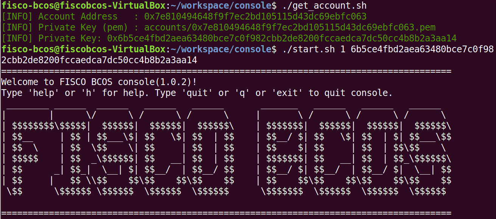
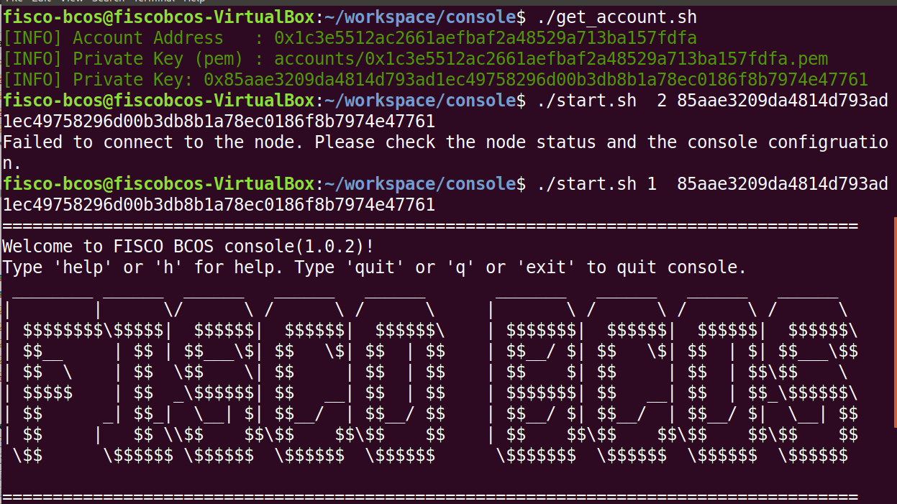
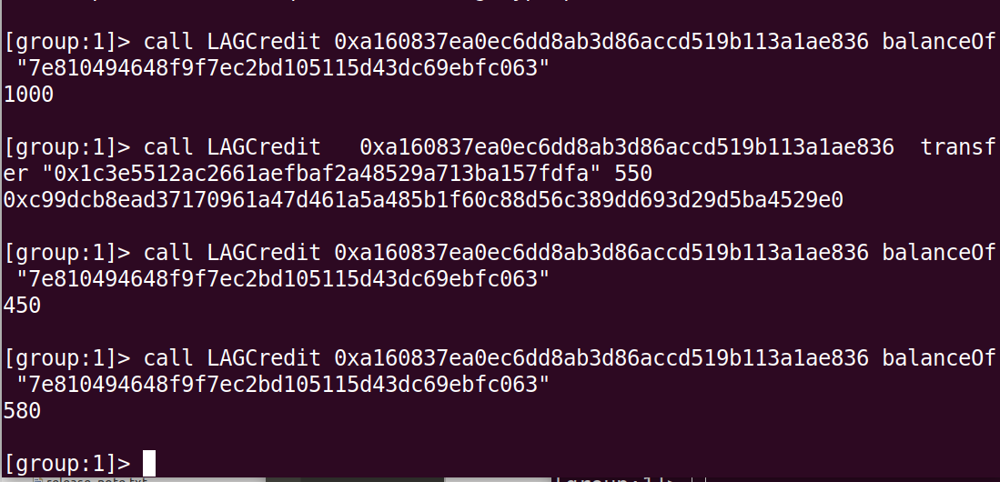
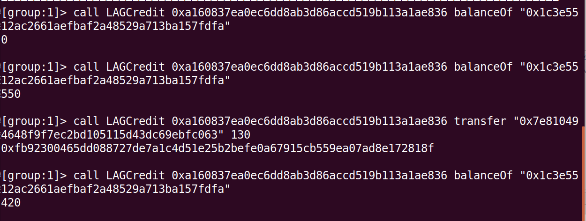

### 创建商家账号并使用私钥登录
  

### 创建用户账号并使用私钥登录
 

### 部署总积分为1000的合约
  

### 初始积分总额1000，为商家所有。商家转给用户550，用户再转给商家130，积分变化过程
#### 商家根据自身公钥查询当前积分值 

#### 用户根据自身公钥获取当前积分值，

| 商家 |  用户  
-|-|-
使用私钥登陆 |使用私钥登陆  | 
部署总积分为1000的合约 |   | 
查询积分（1000） |查询积分（0） |
转出积分（550）|| 
查询积分（450）|查询积分（550）|
||转出积分(130)
查询积分（580）|查询积分（420）|

### 总结
调用get_account.sh脚本后，会生成公钥以及私钥。 
私钥用于登录控制台，相当于一个人的密码。 
公钥用于交易时指定对象，从而指定账户 

