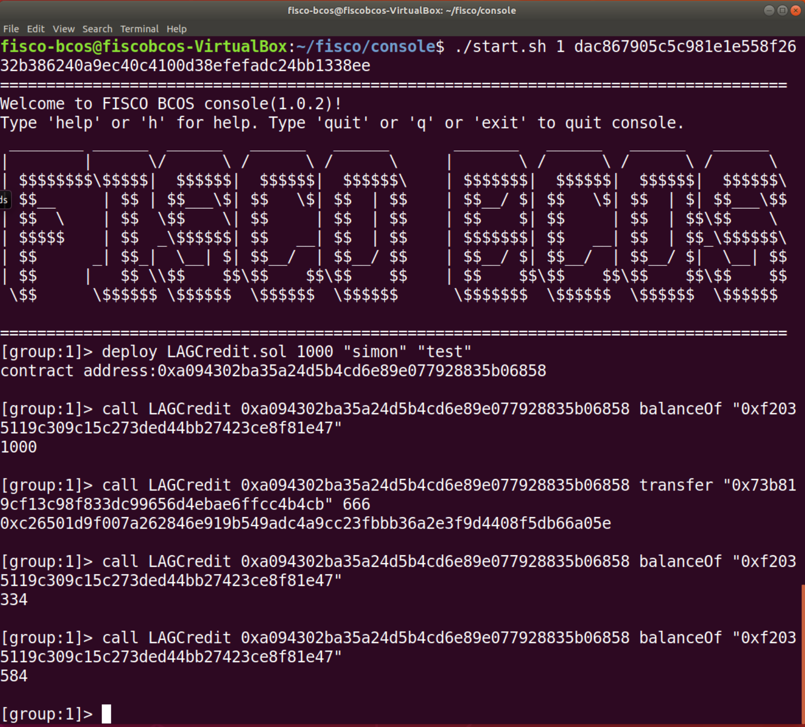
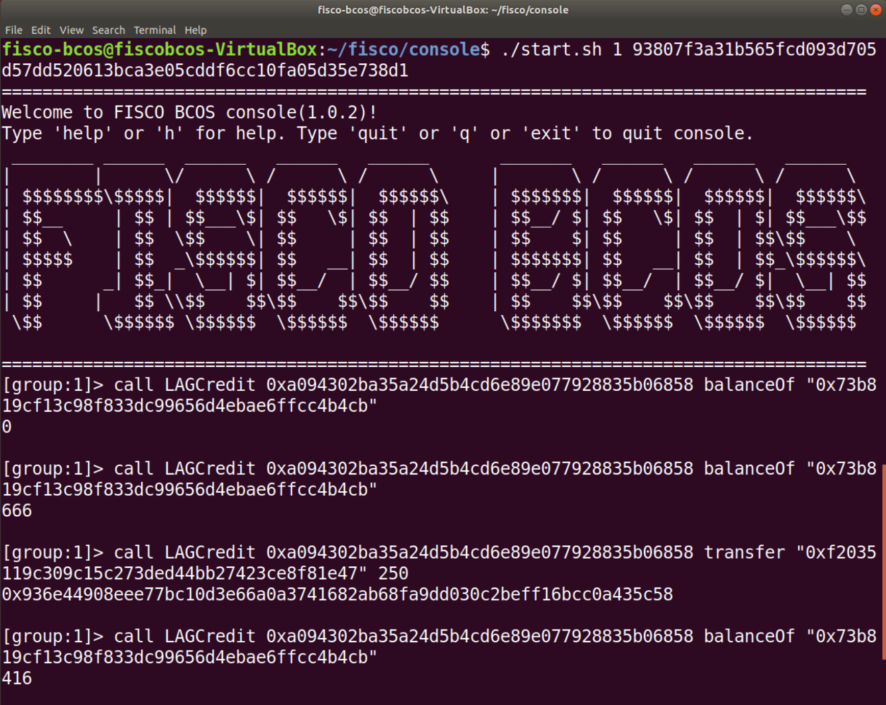
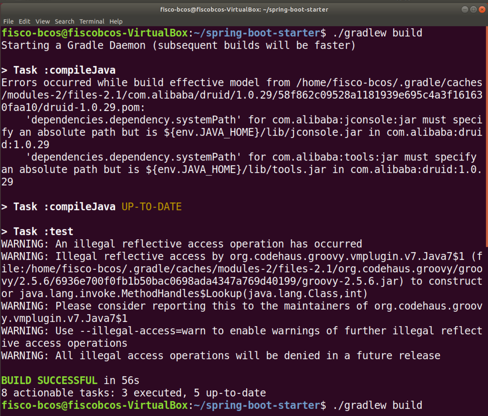

# LAG 积分智能合约部署

## 运行 get_account.sh

商家

客户

## Spring Boot Starter
git clone https://github.com/FISCO-BCOS/spring-boot-starter.git

cd ~/fisco/nodes/127.0.0.1/sdk 

cp ca.crt node.crt node.key ~/spring-boot-starter/src/test/resources/

cd ~/spring-boot-starter/

chmod u+x gradlew

./gradlew build

