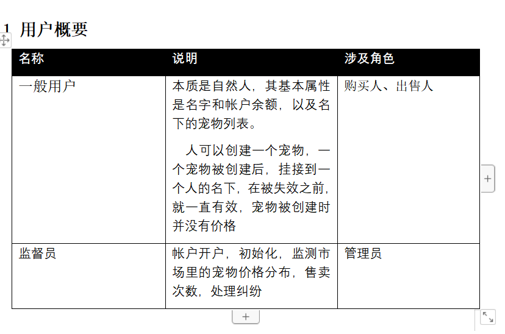
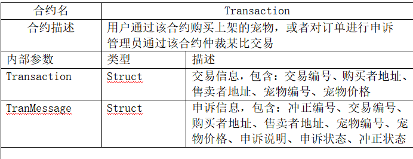
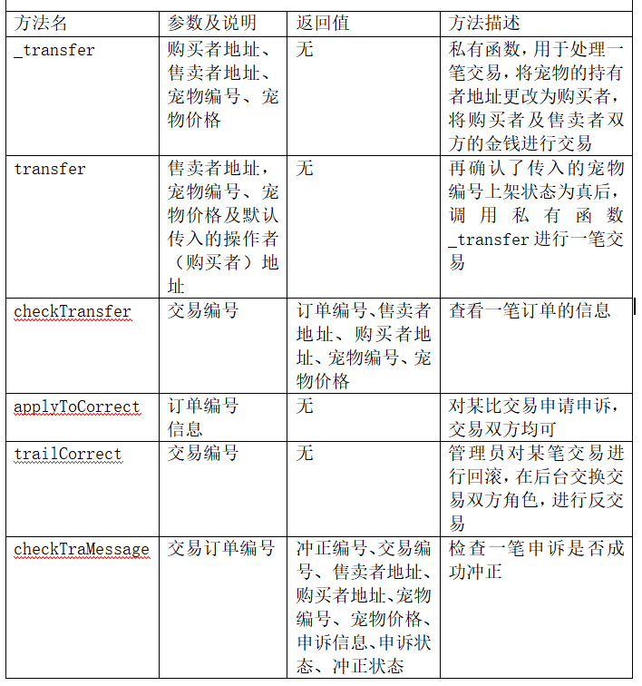

# A：编写详细设计文档

本人负责部分：需求分析（全部）、合约设计


## 一.进行需求分析

### 1.角色分析




详情参考详细设计文档


### 2.功能性分析

  功能架构图：


用例分析示例：


​    详情参考详细设计文档


### 3.非功能性需求分析

**1.** **性能**

在95％的情况下，一般时段响应时间不超过3秒，高峰时段不超过6秒。

支持2000用户，支持MB级数据。

**2.** **安全性**

严格权限访问控制，在账户未开户状态下用户无法进入主页

交易已经完成交易记录便会存在区块链中，无法被更改无法被伪造

 

**3.** **可靠性**

对输入有提示，数据有检查，防止数据异常。

系统健壮性强，应该能处理系统运行过程中出现的各种异常情况，如：人为操作错误、输入非法数据、硬件设备失败等。

要求系统7x24小时运行，全年持续运行故障停运时间累计不能超过3天。

**4.** **易用性**

界面简洁美观


## 二.智能合约设计

### 1.合约模型


### 2.合约描述

#### Account合约


#### Market合约


#### Transaction合约






# B：负责Market合约的编写

代码如下：

```
pragma solidity >=0.4.22 <0.6.0;

import "./Account.sol";

contract Market is Account{

     function _infomation(uint _id) view returns (
         string _name,
         string _species,
         string  _date,
         uint _price,
         string _discribe,
         string _url
    ){
         Pet storage pet = pets[_id];
         
         _name = pet.pet_name;
         _species = pet.species;
         _date = pet.date;
         _price = pet.price;
         _discribe = pet.discribe;
         _url = pet.url;
         
     }
     //私有函数，用于根据传入的宠物编号，寻找并返回所需要的宠物的各项属性值

     function display() {
         for(uint i =0; i < pets.length; i++){
             if(pets[i].pet_state == true){
                 _infomation(i);
             }
         }
     }
     //用于市场主页面的总体展示，凡是状态为已上架的宠物，全部检索并通过调用上一个私有函数返回所需的值

     function myPetDisplay() public {
         for(uint i =0; i<pets.length;i++){
             if(petToOwner[i] == msg.sender){
                 _infomation(i);
             }
         }
     }
     //用于用户查看自己所持有的宠物信息，原理和上个函数一致，只是判断条件不再是宠物是否上架，而是宠物是否归属于操作者
}

```

##### 

