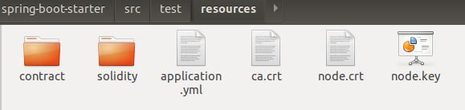
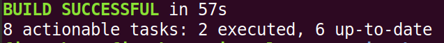

# DAY3周报

吴峻羽
## spring-boot-starter配置

#### 节点证书配置
将节点所在目录`nodes/${ip}/sdk`下的`ca.crt`、`node.crt`和`node.key`文件拷贝到项目的`src/test/resources`目录下供SDK使用。



#### 配置文件设置
spring boot项目的配置文件application.yml如下图所示，其中加了注释的内容根据区块链节点配置做相应修改。
  
```yml
encrypt-type: # 0：普通， 1：国密
 encrypt-type: 0 
 
group-channel-connections-config:
  all-channel-connections:
  - group-id: 1  # 群组ID
    connections-str:
                    - 127.0.0.1:20200  # 节点，listen_ip:channel_listen_port
                    - 127.0.0.1:20201
  - group-id: 2  
    connections-str:
                    - 127.0.0.1:20202  # 节点，listen_ip:channel_listen_port
                    - 127.0.0.1:20203
 
channel-service:
  group-id: 1 # sdk实际连接的群组
  agency-name: fisco # 机构名称

accounts:
  pem-file: 0xcdcce60801c0a2e6bb534322c32ae528b9dec8d2.pem # PEM 格式账户文件
  p12-file: 0x98333491efac02f8ce109b0c499074d47e7779a6.p12 # PKCS12 格式账户文件
  password: 123456 # PKCS12 格式账户密码
```


### 运行
编译并运行测试案例，在项目根目录下运行：
```
$ ./gradlew build
```



当所有测试案例运行成功，则代表区块链运行正常，该项目通过SDK连接区块链正常。开发者可以基于该项目进行具体应用开发。

### Web3j API测试
提供Web3jApiTest测试类测试Web3j API。示例测试如下：
```
@Test
public void getBlockNumber() throws IOException {

    BigInteger blockNumber = web3j.getBlockNumber().send().getBlockNumber();
    System.out.println(blockNumber);
    assertTrue(blockNumber.compareTo(new BigInteger("0"))>= 0);

}
```

  ```
@Autowired
private Web3j web3j
  ```

### Precompiled Service API测试
提供PrecompiledServiceApiTest测试类测试Precompiled Service API。示例测试如下：
```API
@Test
public void testSystemConfigService() throws Exception {
    SystemConfigSerivce systemConfigSerivce = new SystemConfigSerivce(web3j, credentials);
    systemConfigSerivce.setValueByKey("tx_count_limit", "2000");
    String value = web3j.getSystemConfigByKey("tx_count_limit").send().getSystemConfigByKey();
    System.out.println(value);
    assertTrue("2000".equals(value));
}
```

### Solidity合约文件转Java合约文件测试
提供SolidityFunctionWrapperGeneratorTest测试类测试Solidity合约文件转Java合约文件。示例测试如下：
```API
@Test
public void compileSolFilesToJavaTest() throws IOException {
    File solFileList = new File("src/test/resources/contract");
    File[] solFiles = solFileList.listFiles();

    for (File solFile : solFiles) {

        SolidityCompiler.Result res = SolidityCompiler.compile(solFile, true, ABI, BIN, INTERFACE, METADATA);
        System.out.println("Out: '" + res.output + "'");
        System.out.println("Err: '" + res.errors + "'");
        CompilationResult result = CompilationResult.parse(res.output);
        System.out.println("contractname  " + solFile.getName());
        Path source = Paths.get(solFile.getPath());
        String contractname = solFile.getName().split("\\.")[0];
        CompilationResult.ContractMetadata a = result.getContract(solFile.getName().split("\\.")[0]);
        System.out.println("abi   " + a.abi);
        System.out.println("bin   " + a.bin);
        FileUtils.writeStringToFile(new File("src/test/resources/solidity/" + contractname + ".abi"), a.abi);
        FileUtils.writeStringToFile(new File("src/test/resources/solidity/" + contractname + ".bin"), a.bin);
        String binFile;
        String abiFile;
        String tempDirPath = new File("src/test/java/").getAbsolutePath();
        String packageName = "org.fisco.bcos.temp";
        String filename = contractname;
        abiFile = "src/test/resources/solidity/" + filename + ".abi";
        binFile = "src/test/resources/solidity/" + filename + ".bin";
        SolidityFunctionWrapperGenerator.main(Arrays.asList(
                "-a", abiFile,
                "-b", binFile,
                "-p", packageName,
                "-o", tempDirPath
        ).toArray(new String[0]));
    }
    System.out.println("generate successfully");
}
```

该测试案例将src/test/resources/contract目录下的所有Solidity合约文件(默认提供HelloWorld合约)均转为相应的abi和bin文件，保存在src/test/resources/solidity目录下。然后将abi文件和对应的bin文件组合转换为Java合约文件，保存在src/test/java/org/fisco/bcos/temp目录下。SDK将利用Java合约文件进行合约部署与调用。

### 部署和调用合约测试
提供ContractTest测试类测试部署和调用合约。示例测试如下：
```
@Test
public void deployAndCallHelloWorld() throws Exception {
    //deploy contract
    HelloWorld helloWorld = HelloWorld.deploy(web3j, credentials, new StaticGasProvider(gasPrice, gasLimit)).send();
    if (helloWorld != null) {
        System.out.println("HelloWorld address is: " + helloWorld.getContractAddress());
        //call set function
        helloWorld.set("Hello, World!").send();
        //call get function
        String result = helloWorld.get().send();
        System.out.println(result);
        assertTrue( "Hello, World!".equals(result));
    }
}
```