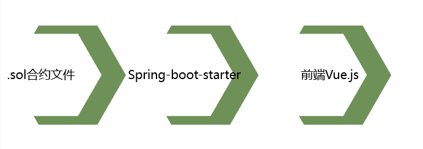

### DAPP架构
  
###### 编写好合约文件后，用spring-boot部署，搭配前端使用Vue.js框架。整体形成一个DAPP。

### 基本合约框架 
#### 帐户管理合约
#### 市场合约
#### 交易合约
#### 冲正管理合约

### 负责账户管理合约的编写   
```
pragma solidity >=0.4.22 <0.6.0;

contract Account{
    struct User{
        string name;
        bool canshop;
    }
    
    struct Message{
        address _from;
        uint _id;
        string messageInfo;
        bool messageState;
        bool trial;
    }
    
    struct Pet{
        uint pet_id;
        string pet_name;
        string species;
        string date;
        uint price;
        string discribe;
        string url;
        bool pet_state;
    }
    
    struct Transaction{
        uint transaction_id;
        address _from;
        address _to;
        uint pet_id;
        uint pet_value;
    }
    
    
    address administrator = 0x6c99f513175769fe9288470f292c928230f0ca71;

    mapping(address => User) users;
    Message[] public messages;
    Pet[] public pets;
    
    //������Ϣ
    event applyMessage(string _messageInfo);
    
    //����Ϣ
    event respondMessage(uint message_id);

    //�����³���
    event newPet(string pet_name, string species, string date, string discribe,string url);

   
    //��Կӳ����
    mapping(address =>uint)  balanceOf;
    //����IDӳ�乫Կ
    mapping (uint => address) public petToOwner; 
    //��Կӳ���������
    mapping (address => uint) ownerPetCount;
    

    //����һ���Ƿ��������,�����˺�
    function addUsers(string name)public{
        users[msg.sender] = User(name,false);
    }
    
    //��������Ȩ��
    function applyCanShop(string _messageInfo) public {
        uint id = messages.push(Message(msg.sender,0,_messageInfo,false,false))-1;
        messages[id]._id = id;
        emit applyMessage(_messageInfo);
    }
    
    //����Ա���ù���Ȩ��
    function setCanShop(uint _id) public{
        require(msg.sender ==administrator && messages[_id].messageState ==false);//����Ա��Կ
        users[messages[_id]._from].canshop = true;
        
        if(balanceOf[messages[_id]._from]==0)
            balanceOf[messages[_id]._from] = 1000;
            
        messages[_id].messageState ==true;
        
        emit respondMessage(_id);
    }
    //�鿴������Ϣ
    function checkInfo() public view returns (string, uint, bool ) {
        string storage _nickname = users[msg.sender].name;
        uint  _balance = balanceOf[msg.sender];
        bool  _canshop = users[msg.sender].canshop;
        return (_nickname, _balance, _canshop);
    }
    
    //�����³���
    function createNewPet(string pet_name,string species,string date, string discribe,string url) public{
        uint petId = pets.push(Pet(0,pet_name,species,date,0,discribe,url,false))-1;
        pets[petId].pet_id = petId;
        petToOwner[petId]=msg.sender;
        ownerPetCount[msg.sender]++;
        emit newPet(pet_name,species,date,discribe, url);
    }
    
    //���ó���������Ϣ
    function setPetPrice(uint pet_id,uint p_price) public{
        require(petToOwner[pet_id]==msg.sender);
        pets[pet_id].price = p_price;
    }

    function setPetName(uint pet_id,string p_name) public{
        require(petToOwner[pet_id]==msg.sender);
        pets[pet_id].pet_name = p_name;
    }
    
    function setPetState(uint pet_id) public{
        require(petToOwner[pet_id]==msg.sender);
        pets[pet_id].pet_state=!pets[pet_id].pet_state;
    }
    
}
```

合约协作，互相调用，完成整体流程